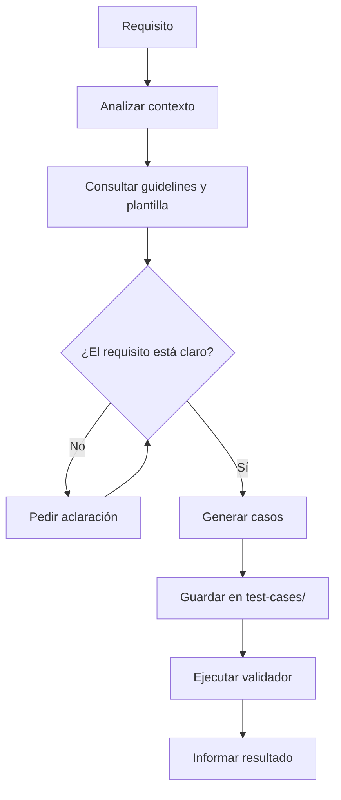
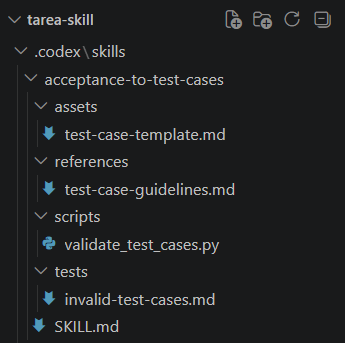
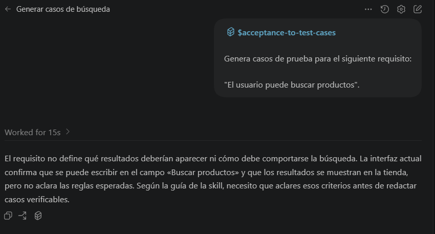
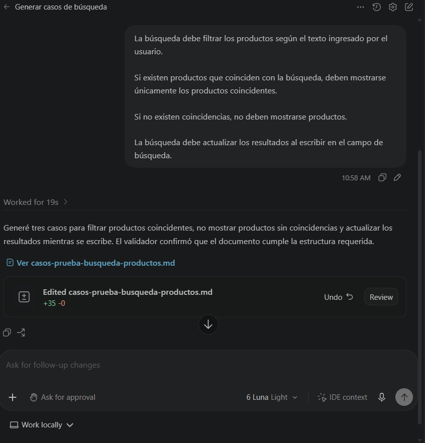
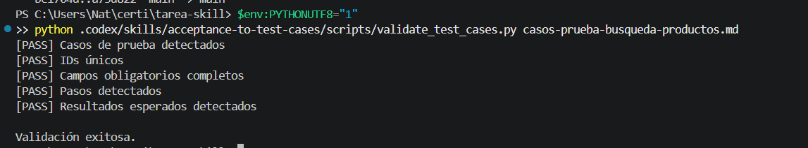
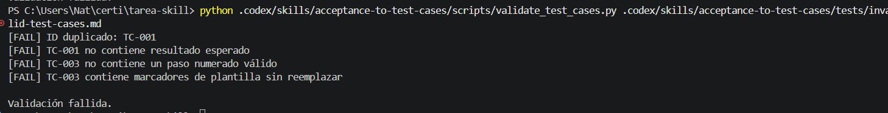

# 🧪 Acceptance to Test Cases

> Convierte requisitos en lenguaje natural en casos de prueba manuales, claros y verificables.

## ¿Qué hace?

Úsala cuando necesites transformar un requisito en casos de prueba. Analiza solo los archivos relevantes para entender el contexto, consulta las pautas y genera un documento en `test-cases/`.

Si el requisito no define un resultado comprobable, la skill pide aclaraciones en vez de inventar reglas. No implementa cambios ni ejecuta los casos sobre la aplicación.

## Estructura de la skill

```text
acceptance-to-test-cases/
├── SKILL.md
├── README.md
├── assets/
│   └── test-case-template.md
├── references/
│   └── test-case-guidelines.md
├── scripts/
│   └── validate_test_cases.py
└── tests/
    └── invalid-test-cases.md
```

- `SKILL.md`: indica cuándo usar la skill y dirige el flujo.
- `assets/test-case-template.md`: estructura que se completa para generar cada documento.
- `references/test-case-guidelines.md`: pautas que se consultan para redactar casos verificables.
- `scripts/validate_test_cases.py`: comprueba la estructura del documento generado.
- `tests/invalid-test-cases.md`: entrada intencionalmente incorrecta para mostrar los errores del validador.

Los casos generados se guardan en `test-cases/`, en la raíz del proyecto. Actualmente hay ejemplos de [búsqueda de productos](../../../test-cases/busqueda-productos.md) y [productos en el carrito](../../../test-cases/agregar-productos-carrito.md).

## Requisitos

- Codex con soporte para Agent Skills.
- Python 3 para ejecutar el validador.
- No requiere dependencias externas ni conexión a Internet.

La skill está en `.codex/skills/acceptance-to-test-cases/` dentro de este repositorio; no requiere instalación adicional.

## Instalación

### Opción A — Usarla en este repositorio

La skill ya está instalada en este proyecto, en `.codex/skills/acceptance-to-test-cases/`. No hace falta copiarla ni instalarla otra vez. Invócala desde Codex:

```text
$acceptance-to-test-cases
```

### Opción B — Instalarla en otro proyecto

Copia la carpeta completa `acceptance-to-test-cases` dentro de `.codex/skills/` del proyecto destino. En Windows PowerShell, sustituye la ruta de ejemplo por la ubicación donde tengas esa carpeta:

```powershell
$origen = "C:\ruta\que\contiene\acceptance-to-test-cases"
New-Item -ItemType Directory -Force ".codex\skills" | Out-Null
Copy-Item -Path $origen -Destination ".codex\skills" -Recurse
```

La estructura quedará así:

```text
mi-proyecto/
└── .codex/
    └── skills/
        └── acceptance-to-test-cases/
            ├── SKILL.md
            ├── README.md
            ├── assets/
            ├── references/
            ├── scripts/
            └── tests/
```

Abre ese proyecto en Codex e invoca la skill:

```text
$acceptance-to-test-cases
```

### Opción C — Instalarla globalmente

Para usarla en distintos proyectos sin copiarla en cada uno, la ubicación global documentada por Codex es `~/.agents/skills/`. En Windows PowerShell:

```powershell
$origen = "C:\ruta\que\contiene\acceptance-to-test-cases"
New-Item -ItemType Directory -Force "$HOME\.agents\skills" | Out-Null
Copy-Item -Path $origen -Destination "$HOME\.agents\skills" -Recurse
```

La carpeta quedará en:

```text
~/.agents/skills/acceptance-to-test-cases/
```

Después, abre otro proyecto en Codex e invoca:

```text
$acceptance-to-test-cases
```

Codex detecta cambios en las skills; si la recién instalada no aparece, vuelve a abrir Codex. Consulta la [documentación de skills de Codex](https://developers.openai.com/codex/build-skills/) para más detalles.

> Copia completa la carpeta `acceptance-to-test-cases`; no copies solo `SKILL.md`, porque la skill también utiliza `assets/`, `references/` y `scripts/`.

## Cómo usarla

Invócala desde Codex y proporciona el requisito:

```text
$acceptance-to-test-cases

Genera casos de prueba para el siguiente requisito:
"El usuario puede buscar productos".
```

La skill revisará el contexto relevante. Si necesita precisar el resultado esperado, preguntará antes de redactar los casos. Luego completará la plantilla, guardará el documento en `test-cases/` y ejecutará el validador.

En el ejemplo de búsqueda, el requisito inicial no especificaba qué hacer con productos coincidentes o sin coincidencias. La skill pidió aclaración y generó los casos después de recibir esos criterios.

> **Evidencia de esta ejecución:**  
> Puedes ver las capturas de este proceso en la sección [Evidencias](#evidencias), donde se muestra la invocación de la skill, la aclaración del requisito, la generación de los casos y su validación.

## Pruébala tú mismo

Este ejemplo es diferente a los casos de búsqueda y carrito que ya existen.

### Entrada

```text
$acceptance-to-test-cases

Genera casos de prueba para el siguiente requisito:
"Al seleccionar una categoría, la tienda muestra únicamente los productos de esa categoría. Al seleccionar 'Todas', vuelve a mostrar todos los productos disponibles".
```

### Resultado esperado

La skill seguirá este flujo:

1. Analizar el requisito y el contexto relevante.
2. Pedir aclaraciones si hay ambigüedades que afecten los resultados esperados.
3. Consultar las pautas y usar la plantilla.
4. Generar el documento en `test-cases/`.
5. Ejecutar el validador.
6. Informar la ruta y el resultado de la validación.

Los casos concretos dependerán del análisis de la skill y no se presuponen aquí.

## Flujo de funcionamiento



## Validación

Validación exitosa:

```bash
python .codex/skills/acceptance-to-test-cases/scripts/validate_test_cases.py test-cases/busqueda-productos.md
```

```text
[PASS] Casos de prueba detectados
[PASS] IDs únicos
[PASS] Campos obligatorios completos
[PASS] Pasos detectados
[PASS] Resultados esperados detectados

Validación exitosa.
```

Validación fallida:

```bash
python .codex/skills/acceptance-to-test-cases/scripts/validate_test_cases.py .codex/skills/acceptance-to-test-cases/tests/invalid-test-cases.md
```

```text
[FAIL] ID duplicado: TC-001
[FAIL] TC-001 no contiene resultado esperado
[FAIL] TC-003 no contiene un paso numerado válido
[FAIL] TC-003 contiene marcadores de plantilla sin reemplazar

Validación fallida.
```

`[PASS]` indica que el documento cumple la estructura esperada y `[FAIL]` que se encontraron errores. El validador revisa el documento generado, no el funcionamiento de la aplicación.

## Evidencias

<details>
<summary>00 · Estructura de la skill</summary>



</details>

<details>
<summary>01 · Invocación y aclaración</summary>



</details>

<details>
<summary>02 · Generación de casos</summary>



</details>

<details>
<summary>03 · Validación correcta</summary>



</details>

<details>
<summary>04 · Validación con errores</summary>



</details>

## Alcance

* La skill genera casos de prueba manuales a partir de requisitos y valida la estructura del documento resultante.

* El validador comprueba el formato de los casos, pero no ejecuta las pruebas ni verifica el funcionamiento real de la aplicación.
